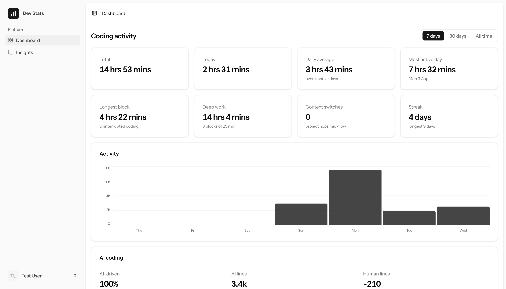
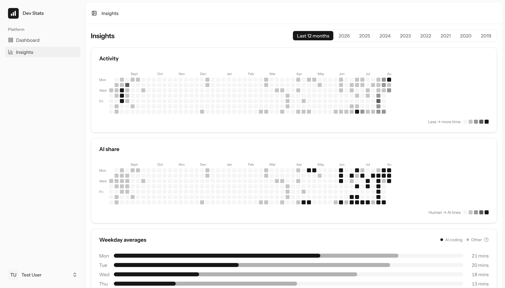
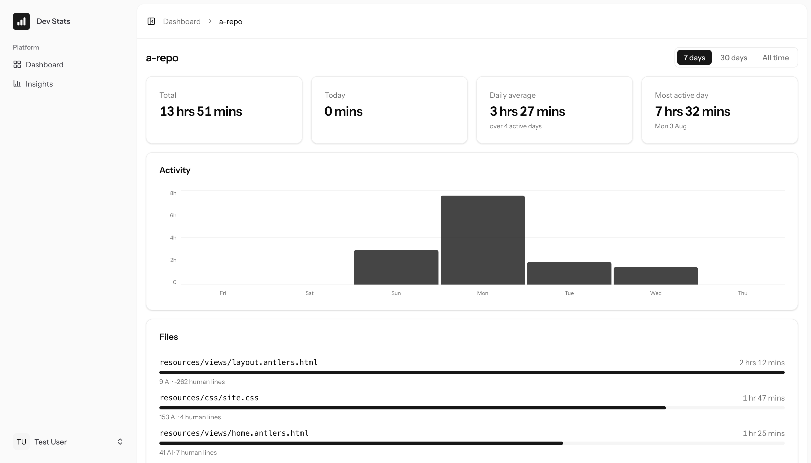

# dev-stats

Self-hosted, WakaTime-compatible coding statistics — with first-class metrics for the **AI era**: how much of your code is AI- vs human-authored, token spend per model, and where the assistant actually helps.

It speaks the same protocol as the standard [`wakatime-cli`](https://github.com/wakatime/wakatime-cli), so every editor plugin that already talks to WakaTime can send its heartbeats here instead — or to both at once.



## Who this is for

This is aimed at the **data-conscious**: people who want their coding-activity stats but would rather **self-host** and keep that data on infrastructure they control, instead of sending it to a third party.

If that isn't you, please **support [WakaTime](https://wakatime.com)** — sign up, and ideally pay for it. They built the entire ecosystem of editor plugins this project depends on, they run a genuinely great hosted product, and they deserve to be supported. dev-stats is a self-host-for-privacy alternative, **not** a way to dodge paying for their work.

## Features

**Dashboard**
- Total, today, daily-average and most-active-day time at a glance.
- Focus metrics — longest uninterrupted block, deep-work time, context switches.
- Coding streaks.
- AI coding: AI vs human line authorship, token usage, estimated spend, and a per-model agent breakdown.
- Editing activity (reads vs writes) and breakdowns by project, language, editor, OS and category.

**Insights**
- Activity and AI-share calendar heatmaps across a rolling year or any past year.
- Weekday averages with the AI portion split out.
- Top projects and files ranked by time, by AI lines, and by human lines.



**Project detail**
- Per-project time, activity and breakdowns, plus the files you spent the most time in — shown relative to the project root.



## How it works

```
wakatime-cli ──▶ /api/v1 heartbeats ──▶ durations ──▶ daily summaries ──▶ dashboards
   (editor)         (raw events)        (sessions)     (nightly rollup)
```

Raw heartbeats are ingested and deduplicated, folded into coding **sessions** (durations), then rolled up nightly into per-day **summaries**. Reads serve whole past days from the stored summaries and compute only today live, so the dashboards stay fast as history grows. Everything downstream of heartbeats is a regenerable cache.

## Tech stack

- **Laravel 13** (PHP 8.5) with a WakaTime-compatible ingestion API
- **Inertia v3** + **Vue 3** + **Tailwind CSS v4**
- **MySQL** in production, **SQLite** for tests
- **Pest** for the test suite, **Larastan** (level 7) for static analysis, **Pint** for formatting

## Getting started

```bash
git clone https://github.com/nebarg/dev-stats.git
cd dev-stats

composer install
npm install

cp .env.example .env
php artisan key:generate
php artisan migrate

npm run dev        # or `npm run build` for production assets
```

The app is served at `https://dev-stats.test` under [Laravel Herd](https://herd.laravel.com); adjust `APP_URL` and your database settings in `.env` for your own environment.

## Connecting your editor

Any editor with a WakaTime plugin can send here. Grab your **API key** and the exact **API URL** from the in-app **Settings → Tracking** page, then point `~/.wakatime.cfg` at them:

```ini
[settings]
api_url = https://dev-stats.test/api/v1
api_key = <your dev-stats api key>
```

To keep sending to WakaTime *and* mirror to dev-stats, leave your WakaTime key in `[settings]` and add a mirror under `[api_urls]`:

```ini
[api_urls]
.* = https://dev-stats.test/api/v1|<your dev-stats api key>
```

## Development

```bash
php artisan test          # backend suite (Pest)
npm run test              # frontend unit tests (Vitest)
vendor/bin/pint           # format PHP
npm run lint              # format / lint the frontend
vendor/bin/phpstan analyse
npm run types:check
```

## Screenshots

Screenshots live in [`docs/screenshots/`](docs/screenshots) and are referenced by relative path so they render on GitHub. Replace `dashboard.png`, `insights.png` and `project.png` with your own captures.

## Licence

Licensed under the **[GNU Affero General Public License v3.0](https://www.gnu.org/licenses/agpl-3.0.html)** (AGPL-3.0). You're free to use, modify and self-host it — but if you run a modified version as a network service, you must make your modified source available to its users under the same licence. In short: keep it open.

If you'd rather not run your own instance, please support **[WakaTime](https://wakatime.com)** instead.
